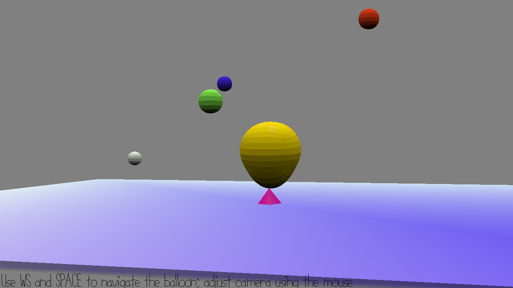

# Collect/Pinch

Author: Xinyi Sun

Design: I took my model from game2 and the relevant code part and made modifications based on that. Instead of using the floating balls to rise, the balloon now needs to either collect or pinch the ball by listening to the sound it makes. After correctly pinching/collecting all balls, balloon wins.

Screen Shot:

How To Play:
Use W and S to rise or go down. Use Space to move in the direction that the camera is facing. Use mouse to adjust camera/direction of the balloon. Press L to listen to the sound of a ball when you're close enough, which can either be bass sound or coin-collection like. Press C to collect it or P to pinch it.

Sources: Sounds are made with GarageBand (definitely an underuse though).

This game was built with [NEST](NEST.md).

